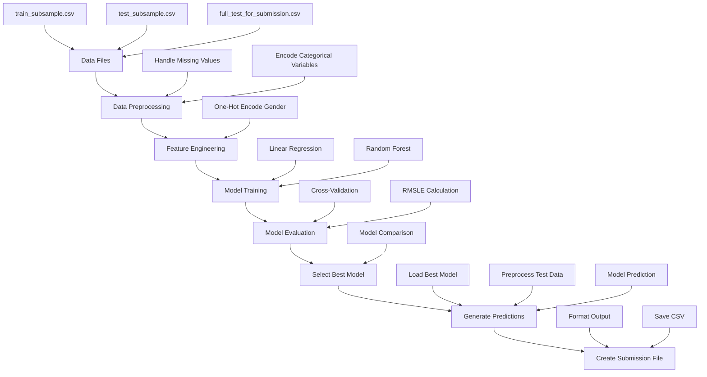

# Model Architecture Diagram

## Workflow Overview

## Data Flow Explanation

1. **Data Input**: Three CSV files containing training and test data
2. **Preprocessing**: Handle missing values and encode categorical variables
3. **Feature Engineering**: One-hot encode the Gender column
4. **Model Training**: Train both Linear Regression and Random Forest models
5. **Evaluation**: Use cross-validation and RMSLE metric to compare models
6. **Selection**: Choose the better performing model based on evaluation
7. **Prediction**: Generate predictions on test data using best model
8. **Submission**: Format and save predictions in required CSV format

## Model Comparison Metrics

- **Linear Regression**: 
  - Pros: Simple, fast, interpretable
  - Cons: Assumes linear relationships
  
- **Random Forest**:
  - Pros: Handles non-linear relationships, feature interactions
  - Cons: More complex, slower to train

## Evaluation Strategy

- Use RMSLE (Root Mean Squared Logarithmic Error) as specified
- Implement k-fold cross-validation for robust evaluation
- Compare models on validation set before final prediction